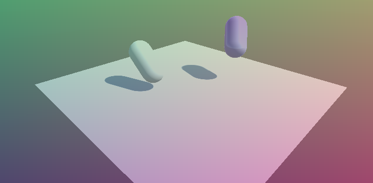

# stencil-buffer-post-process
An example of using the stencil buffer to select specific pixels for processing in post processing effects in Unity.



This projects provides an example of how to discard pixels in a post processing effect using the stencil buffer.

In this example, the following steps are taken in the `OnRenderImage` event.

```
Pass #1: Write 0 to the stencil buffer
Pass #2: Write 1 to the stencil buffer if the roughness form the GBuffer is below a certain threashold
Pass #3: Apply an image effect where stencil buffer values are 0
Pass #4: Apply another image effect where stencil buffer values are 1
```

Thus, in this example, there are two image effetcs (each as a pass) in the shader

```
fixed4 FragmentMix1(Varyings input) : SV_Target
{
    return lerp(tex2D(_MainTex, input.uv), fixed4(input.uv, .5, 1.), .5);
}
```

and

```
fixed4 FragmentMix2(Varyings input) : SV_Target
{
	return lerp(tex2D(_MainTex, input.uv), 1. - fixed4(input.uv, .5, 1.), .5);
}
```

`FragmentMix1` is applied when the roughness stored in the GBuffer is below a given threshold, and `FragmentMix2` is applied otherwise.
